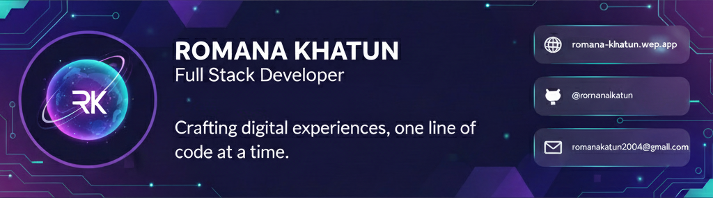

  

  
  
  

### 💫 About Me

I am a specialized **MERN Stack Developer** dedicated to building secure, scalable, and high-performance web applications. My expertise lies in architecting complex front-end systems. 
---

## 🚧 Current Activities

- Advancing my skills in **React.js advanced patterns** for scalable and reusable UI development.
- Exploring **backend development** to improve API structure and data flow.
- Learning **Next.js** to build performant, SEO-optimized React applications.
- Strengthening full-stack development best practices.

---

## 🚀 Technical Journey

- Front-end Developer Intern at **Namyata Technology** (Remote – Delhi, India).
- Exploring advanced React patterns for scalable UI development.
- Building and scaling Textila with Stripe integration and RBAC.
- Improving declarative UI design and state management.

---

### 🛠️ Languages & Tools

| Category         | Tools & Technologies                                                  |
| :--------------- | :-------------------------------------------------------------------- |
| **Frontend**     | `React.js`, `Next.js`, `TypeScript`, `Redux`, `Sass`, `Tailwind CSS`  |
| **Backend**      | `Node.js`, `Express.js`, `Rest APIs`, `JWT Authentication`            |
| **UI & Styling** | `Tailwind CSS`, `Framer Motion`, `Sass`, `Material UI`                |
| **Database**     | `MongoDB`, `Firebase`, `PostgreSQL`                                   |
| **DevOps/Tools** | `Git`, `GitHub`, `Vercel`, `Heroku`, `Stripe API`, `Google Analytics` |

  

---

### 📊 GitHub Activity & Insights

  

  
  

---

<h2 align="center">🤝 Let's Connect & Collaborate</h2>

  
  
  

  <i>"Passionate about building scalable MERN applications and solving complex problems."</i>

